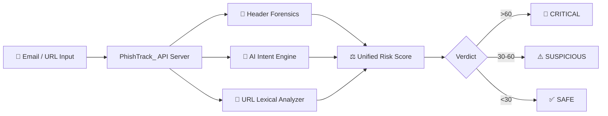

<div align="center">

# 🛡️ PhishTrack_

### AI-Powered Real-Time Phishing Detection Platform

[](https://python.org)
[](https://fastapi.tiangolo.com)
[](https://developer.chrome.com/docs/extensions/)
[](https://huggingface.co/distilbert-base-uncased)
[](LICENSE)

<br/>

*A full-stack anti-phishing platform combining **NLP-driven AI analysis**, **email header forensics**, and **lexical URL inspection** to detect phishing threats in real-time — delivered through a **FastAPI server**, **web dashboard**, and **Chrome browser extension**.*

<br/>

</div>

---

## 🧠 How It Works

PhishTrack_ uses a **multi-layered threat detection pipeline** that combines three independent analysis engines for maximum accuracy:



| Layer | Engine | Technique | Weight |
|-------|--------|-----------|--------|
| 🔬 **Header Forensics** | `forensics.py` | SPF, DKIM, DMARC validation & Reply-To mismatch detection | 20% |
| 🤖 **AI Intent Analysis** | `ai_engine.py` | DistilBERT NLP + regex-based semantic phishing patterns | 60% |
| 🔗 **URL Analysis** | `forensics.py` | Typosquatting detection, IP-based URLs, suspicious TLD flagging | 20% |

---

## ✨ Key Features

- **🤖 AI-Powered Detection** — DistilBERT transformer model with layered semantic pattern matching for identifying phishing language, urgency tactics, and social engineering
- **🔬 Email Header Forensics** — Validates SPF, DKIM, and DMARC authentication protocols; detects Business Email Compromise (BEC) via Reply-To mismatches
- **🔗 URL Threat Analysis** — Catches typosquatting, raw IP-based URLs, and suspicious TLDs (`.xyz`, `.top`, `.ru`, etc.)
- **📡 Live URL Scraping** — Actively fetches and analyzes page content in real-time for URL-only scans
- **🧩 Chrome Extension** — Manifest V3 browser extension with one-click email scanning directly from your inbox
- **📊 Web Dashboard** — Interactive threat analytics dashboard with scan history and risk breakdowns
- **⚡ Fast Inference** — Sub-second analysis with latency tracking on every scan
- **🛡️ Anti-Evasion** — Detects Cloudflare/anti-bot shields used by phishing sites to evade scanners

---

## 📁 Project Structure

```
PhishTrack/
│
├── PhishTrack_Server/          # 🖥️ FastAPI Backend + Web UI
│   ├── main.py                 # API server & scan orchestration
│   ├── ai_engine.py            # DistilBERT AI + semantic pattern engine
│   ├── forensics.py            # Header forensics & URL lexical analysis
│   ├── requirements.txt        # Python dependencies
│   ├── start_server.bat        # One-click server launcher (Windows)
│   ├── test_api.py             # API endpoint tests
│   ├── test_ai_logic.py        # AI engine unit tests
│   └── static/                 # Web frontend
│       ├── index.html          # Main scanner interface
│       ├── app.js              # Frontend logic
│       └── style.css           # UI styling
│
├── PhishTrack_Extension/       # 🧩 Chrome Browser Extension
│   ├── manifest.json           # Extension manifest (MV3)
│   ├── popup.html              # Extension popup UI
│   ├── popup.js                # Extension popup logic
│   ├── background.js           # Service worker
│   ├── content.js              # Content script for email extraction
│   └── icon*.png               # Extension icons
│
└── PhishTrack_/                # 📊 Standalone Analytics Dashboard
    ├── app.py                  # Streamlit/Flask dashboard app
    ├── index.html              # Landing page
    ├── dashboard.html          # Analytics dashboard
    └── requirements.txt        # Dashboard dependencies
```

---

## 🚀 Quick Start

### Prerequisites

- **Python 3.10+**
- **Google Chrome** (for the extension)

### 1. Clone & Install

```bash
git clone https://github.com/YOUR_USERNAME/PhishTrack.git
cd PhishTrack/PhishTrack_Server

# Create virtual environment (recommended)
python -m venv venv
venv\Scripts\activate        # Windows
# source venv/bin/activate   # macOS/Linux

# Install dependencies
pip install -r requirements.txt
```

### 2. Launch the Server

```bash
python main.py
```

The API server starts at **`http://127.0.0.1:8000`** — open it in your browser for the web scanner UI.

### 3. Load the Chrome Extension

1. Open `chrome://extensions/`
2. Enable **Developer mode** (top right)
3. Click **Load unpacked** → select the `PhishTrack_Extension/` folder
4. Pin the extension and start scanning emails!

---

## 🔌 API Reference

### `GET /health`
Health check endpoint.

```json
{ "status": "active", "model": "DistilBERT-PhishFinder", "version": "6.0.0" }
```

### `POST /scan/email`
Analyze an email for phishing threats.

**Request Body:**
```json
{
  "headers": "Authentication-Results: spf=pass; dkim=pass",
  "body_text": "Your account has been suspended. Click here to verify.",
  "urls": ["https://paypal-secure-login.xyz/verify"],
  "sender": "security@paypa1.com"
}
```

**Response:**
```json
{
  "risk_score": 92.5,
  "verdict": "CRITICAL",
  "components": {
    "header_risk": 0,
    "ai_intent_risk": 75.0,
    "url_max_risk": 70
  },
  "logs": [
    "🚫 CRITICAL: High-confidence phishing attempt detected.",
    "⚠️ Pattern: 2 suspicious semantic pattern(s) detected.",
    "⚠️ Brand Impersonation: 'paypal' found in non-official domain."
  ],
  "latency_ms": 245.32
}
```

---

## 🛠️ Tech Stack

| Component | Technology |
|-----------|-----------|
| **Backend API** | FastAPI, Uvicorn, Pydantic |
| **AI / NLP** | HuggingFace Transformers, DistilBERT, ONNX Runtime |
| **Web Scraping** | Requests, BeautifulSoup4 |
| **Frontend** | HTML5, CSS3, Vanilla JavaScript |
| **Browser Extension** | Chrome Manifest V3 |
| **Dashboard** | Streamlit, Plotly, Pandas |
| **Testing** | Python unittest |

---

## 📜 License

This project is licensed under the **MIT License** — see the [LICENSE](LICENSE) file for details.

---

<div align="center">

**Built with 🧠 AI & ☕ Coffee**

</div>
